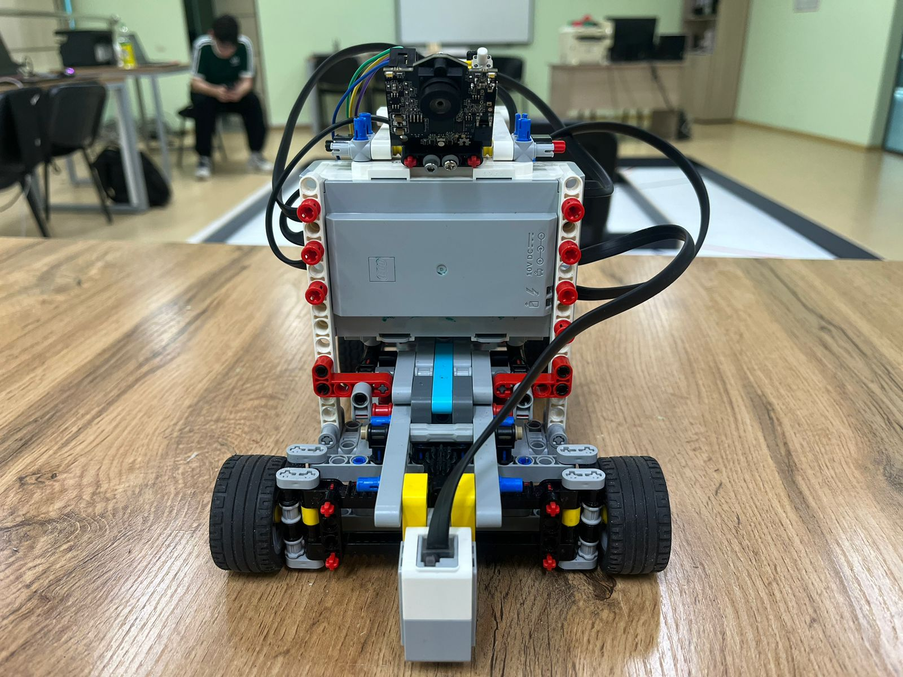
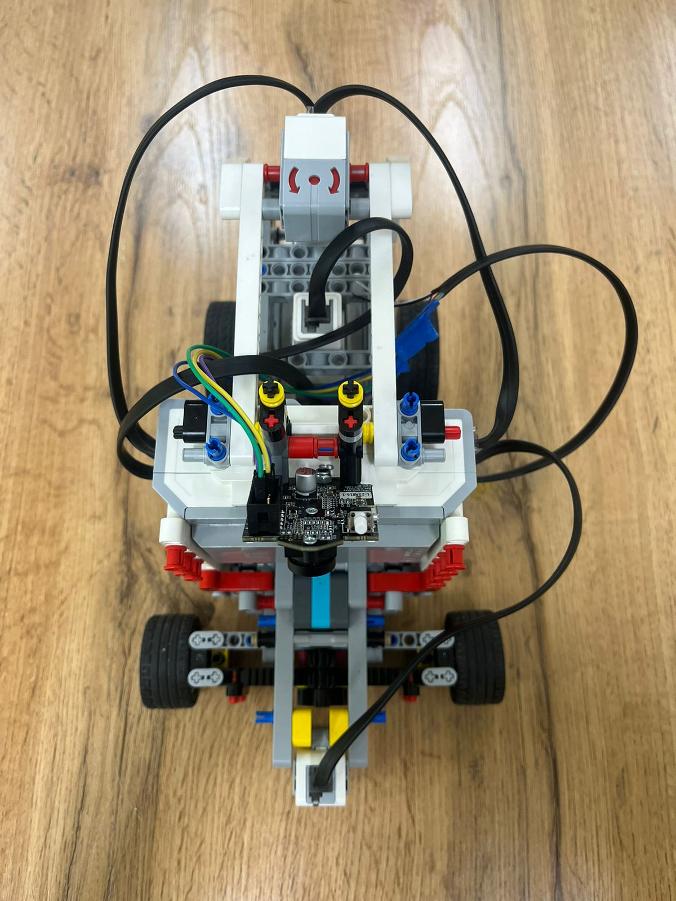

# WRO Future Engineers - Team Retired Engineers

## Table of Contents
1. [Introduction](#introduction)
2. [Robot Design](#robot-design)
   - [Mobility Management](#mobility-management)
   - [Power and Sensing Management](#power-and-sensing-management)
   - [Obstacle Management](#obstacle-management)
3. [Technical Specifications](#technical-specifications)
4. [Software](#software)
5. [Photos and Video](#photos-and-video)
6. [Team Information](#team-information)

## Introduction

Welcome to our WRO Future Engineers project repository! This README provides comprehensive information about our robot design, features, and development process for the 2024 World Robot Olympiad Future Engineers category.

## Robot Design

### Mobility Management

- **Drive System**: Rear-wheel drive powered by two LEGO medium motors
- **Wheel Specifications**: 31mm radius wheels
- **Gear Configuration**: 
  - Two large gears (one per motor) connected by a small gear
  - Additional large gear attached to the small gear, connecting to a differential
- **Differential**: Installed on rear wheels
- **Steering**: Horizontally mounted medium motor controlling the front axle

**Design Rationale:**
- LEGO components for ease of assembly and modification
- Motors with similar manufacturing origins for synchronized operation
- EV3 brick mounted sideways for convenient battery replacement

**Dimensions**: 268mm (length) x 166mm (width) x 204mm (height)

**Mass**: ~850g

### Power and Sensing Management

- **Power Source**: LEGO EV3 Intelligent Brick with rechargeable lithium-ion battery

**Sensor Suite:**

1. **LEGO Color Sensor**
   - Purpose: Detection of orange and blue field markings
   - Location: front

2. **Pixy2 Camera**
   - Purpose: Identification of red and green objects
   - Location: top-front

3. **LEGO Gyro Sensor**
   - Purpose: Precise rotational control and orientation tracking
   - Location: back-top

### Obstacle Management
**Strategy for Qualification Round**

Our strategy for the qualification round is based on detecting orange and blue colors. The robot's behavior is determined by which color it sees first. If the robot detects blue color initially, it begins one scenario where it turns left every time the color sensors do not detect white. In the alternative scenario, triggered by detecting orange first, the robot turns right whenever it does not see white. We utilize the gyro sensor to ensure correct rotation to exactly 90 degrees for each turn. Additionally, we employ the gyro sensor for path correction. If the robot's orientation exceeds 93 degrees, it rotates slightly to the left, and if the orientation is less than 87 degrees, it rotates to the right. This approach allows for precise navigation and course correction throughout the qualification round.

So, we decided to prepare for the worst scenario, when we have all 4 walls elongated:
Our estimated path looks like this (for the orange color):


**Strategy for Obstacle Round**

Our strategy for the obstacle round builds upon the approach used in the qualification round, but incorporates the use of a Pixy v2 camera for enhanced obstacle detection. The core navigation principles remain the same, with the robot responding to color cues and using the gyro sensor for precise turns and path corrections. However, the addition of the Pixy v2 camera allows for more sophisticated obstacle avoidance.
When the Pixy v2 camera detects either red or green color, indicating an obstacle, the robot initiates an avoidance maneuver. It begins to turn until the detected color is no longer in view. Once the obstacle is cleared from its field of vision, the robot then rotates to align itself parallel to the original direction of the path. This ensures that the robot maintains its overall course while successfully navigating around obstacles.
The gyro sensor continues to play a crucial role in this round, enabling the robot to execute precise turns both for regular navigation and obstacle avoidance. The color sensors are still utilized for detecting the main path, allowing the robot to stay on course when not dealing with obstacles. This combined use of the Pixy v2 camera, gyro sensor, and color sensors allows for a robust and adaptive approach to the obstacle round, enabling the robot to navigate complex environments while maintaining its intended trajectory.

## Technical Specifications

- **Processor**: LEGO EV3 Intelligent Brick
- **Motors**: 
  - 2x LEGO Medium Motors (Rear drive)
  - 1x LEGO Medium Motor (Front steering)
- **Sensors**:
  - 1x LEGO Color Sensor
  - 1x Pixy2 Camera
  - 1x LEGO Gyro Sensor
- **Power Source**: Rechargeable lithium-ion battery (EV3 brick)
- **Programming Language**: Basic(Clev3r)

## Software

```python
// OFDL Modules Test Program

// Define project folder
Set project folder to "prjs\OFDL_ExPrj"

// Import required modules
Import Color, Gyro, Ultrasonic, and Pixy2 modules

// Initialize display and show battery voltage
Clear LCD
Display battery voltage on LCD

// Set sensor ports
ColorSensorPort = 3
GyroSensorPort = 1
UltrasonicPort = 2

// Reset gyro sensor
Reset Gyro sensor on port 1
initialAngle = 0

// Define turning functions
Function turnToAngleRight(numberofturns):
    // Turn robot right by specified number of 90-degree turns
    // Uses gyro sensor for precise turning
    // Adjusts motor power for smooth turning and stopping

Function turnToAngleRightLast(numberofturns):
    // Similar to turnToAngleRight, but with slight adjustments for the last turn

Function turnToAngleLeft(numberofturns):
    // Turn robot left by specified number of 90-degree turns
    // Uses gyro sensor for precise turning
    // Adjusts motor power for smooth turning and stopping

Function turnToAngleLeftLast(numberofturns):
    // Similar to turnToAngleLeft, but with slight adjustments for the last turn

Function turnToAngleRightFirst(numberofturns):
    // Similar to turnToAngleRight, but with adjustments for the first turn

Function turnToAngleLeftFirst(numberofturns):
    // Similar to turnToAngleLeft, but with adjustments for the first turn

Function color():
    // Detect color using the color sensor
    // Returns:
    // 6 if green is detected
    // 5 if red is detected
    // 1 otherwise (assuming blue or other colors)

// Main program loop
While true:
    Detect color
    
    If color is red (5):
        // Perform right turns
        For i from 1 to 12:
            If i is 1:
                Use turnToAngleRightFirst
            ElseIf i is 12:
                Use turnToAngleRightLast
            Else:
                Use turnToAngleRight
            
            Wait for white color (possibly a line)
            Make small adjustments to maintain correct angle
        
        Stop motors and end program
    
    ElseIf color is blue (1):
        // Perform left turns
        For i from 1 to 12:
            If i is 1:
                Use turnToAngleLeftFirst
            ElseIf i is 12:
                Use turnToAngleLeftLast
            Else:
                Use turnToAngleLeft
            
            Wait for white color (possibly a line)
            Make small adjustments to maintain correct angle
        
        Stop motors and end program
    
    Else:
        // If no red or blue detected, move forward slowly
        Set motor power to -25 (move forward)
    
    Wait for 50 milliseconds
```

## Photos and Video

### Team Photos
Team photos are in the `t-photos` folder.

<details>
<summary>Click to view team photo</summary>


*Caption: [Your Team Name] at [Event/Location]*

</details>

### Vehicle Photos
Robot photos are in the `v-photos` folder.

<details>
<summary>Click to view robot photos</summary>


*Front view of our robot*


*Side view showcasing the drive system*


*Top view highlighting sensor placement*

</details>

### Video Demonstration

[[Robot Demo Video](https://youtu.be/v8r7JQF2mQA?si=ztm9AK12ajWzkM_R)]

## Team Information

- **Team Name**: Retired Engineers
- **Country/Region**: Kazakhstan, Semey
- **Members**:
  - Akhmetzhanov Alemzhan
  - Serikgali Daulet
